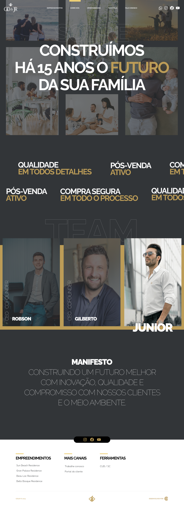

## :rocket: Teste técnico para Desenvolvedor(a) Front-end Júnior

O seguinte teste foi planejado para validar os conhecimentos necessários para a posição de Desenvolvedor(a) Front-end Júnior.

Serão avaliados aspectos relacionados aos conhecimentos em boas práticas de desenvolvimento, além dos conhecimentos nas tecnologias HTML, CSS, JavaScript, React.js e no ecossistema em volta.

É esperado que você codifique uma interface de forma eficiente e elegante (estamos confiantes de que você pode vencer a vontade de fazer gambiarras :stuck_out_tongue_winking_eye:), e demonstre sua atenção em detalhes, capacidade de aprender e agregar valor.

Recomendamos partir da premissa de que, o presente teste está sendo desenvolvido para compor um projeto de larga escala, portanto seu código deve estar à altura.

Esperamos também que você se divirta e aprenda algo no processo. :blush:

## :eyes: O problema

Uma interface feita por um designer inspirado, rs.

- https://www.figma.com/file/p9OqAsq6EG4INjumXBi4WX/GD-%26-JR?type=design&node-id=0%3A1&mode=design&t=7DtCCKryt8g9owuF-1

## :bulb: A proposta

Você deve codificá-la :smiley:, utilizando HTML, CSS, JavaScript e NextJS.

Encorajamos o uso de  um framework de utility-first como Tailwind CSS, ou bibliotecas CSS-in-JS como styled-components, sobretudo visando delimitar o escopo da estilização (em seus respectivos componentes).

## :dart: Requisitos do projeto

- A interface deve ser 100% responsiva;
- Fazer uso de uma ou mais ferramentas "linter";
- Usabilidade (botões devem ter cursor do tipo pointer, feedbacks visuais de hover, etc);
- Hospedar a aplicação, permitindo o acesso através de uma URL (você pode usar plataformas gratuitas, como Vercel, Netlify, Heroku e afins);
- Fornecer uma documentação, por meio de um arquivo README.md, acerca do seu projeto. Inclua instruções completas para a execução da aplicação, e comentários que julgar pertinentes à avaliação...

## :clap: Diferenciais

- Animações;
- Escrever um ou mais testes de unidade :)
- Uso de Axios ou Apollo para chamadas à API.
- Uso de Typescript.
- HTML semântico (Usando tags apropriadas).

## :page_facing_up: Critérios de avaliação

- A qualidade do seu **código**;
- O cumprimento dos **requisitos**;
- A **fidelidade** da interface codificada;
- A **estrutura** do seu projeto: esperamos ver componentização coesa, reuso, encapsulamento, separação de responsabilidades, etc;
- A **responsividade** da aplicação: deve adaptar-se com maestria para absolutamente qualquer tamanho de tela, desde pequenos smartphones até monitores ultrawide;
- Seu **empenho**: não tem problema se algo não sair como desejado, mas tente! :blush:

## :lock: Autoria

O projeto desenvolvido durante o teste em questão **não será utilizado** para quaisquer outros fins além da avaliação do candidato.

## :warning: Atenção

**Não serão avaliados testes técnicos cuja aplicação não esteja hospedada**. O acesso deve estar disponível através de uma URL (você pode usar plataformas gratuitas, como Vercel, Netlify, Heroku e afins), que obrigatoriamente deve ser informada na documentação e email de entrega / mensagem via whatsapp .

## :email: Sobre a entrega

Pedimos que, por gentileza, entregue o teste em até 7 dias a partir do recebimento das instruções, no GitHub. Neste repositório, **adicione como colaboradores os usuários [@dev-inover](https://github.com/dev-inover)**

Se por motivos de força maior não for possível cumprir com o prazo, por gentileza, nos informe.
